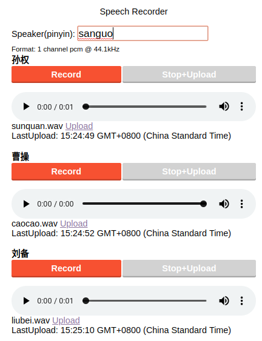

# Web voice recorder
Fork from https://github.com/addpipe/simple-recorderjs-demo



## How to use
```python
python upload.py
```

## Procedure
1. Web records wav(16 bit, 1 channel, frame rate based on Client Device)
2. Python receives wav and convert to 16kHz frame rate.
3. Speech Recognition. 

## Notes
- Tested on Python 3.6
- iOS上只能录制4-5条语音，原因未知
- Only Demo code, not best practice

## TODO
- 限制每条语音长度
- 待录制语音达到100条时，浏览器空间是否支持
- 开启新的条目录音时，自动检测是否还有未Stop的录音条目

## Why
- 使用[Recorderjs](https://github.com/mattdiamond/Recorderjs)是其在各浏览器兼容性不错，同时需要是录制wav，虽然其2016年之后已不更新。